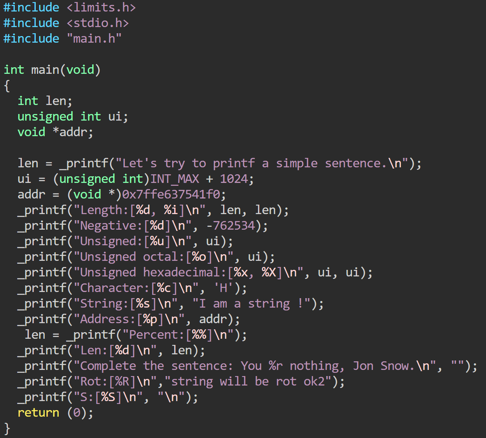
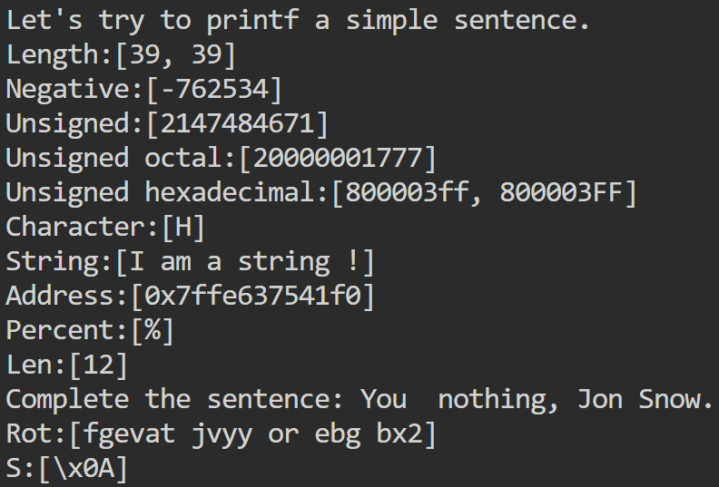

# _printf

A simplified printf from \<stdlib\>.

## Description

_printf is an integer function which takes variadic input, and writes buffered and formatted output to stdout.

## Usage

### Input

### Output

## Return Value

Returns the total number of characters written.
Returns (-1) on error.

## Supported Conversion Specifiers

| Specifier | Description                                      | Example Input                                          | Example Output                              |
|-----------|--------------------------------------------------|--------------------------------------------------------|---------------------------------------------|
| `%c`      | Prints a single character                        | `_printf("Character:[%c]\n", 'H');`                    | `Character:[H]`                             |
| `%s`      | Prints a string of characters                    | `_printf("String:[%s]\n", "I am a string !");`         | `String:[I am a string !]`                  |
| `%%`      | Prints a literal percent sign                    | `_printf("Percent:[%%]\n");`                           | `Percent:[%]`                               |
| `%d`      | Prints a signed decimal integer                  | `_printf("Negative:[%d]\n", -762534);`                 | `Negative:[-762534]`                        |
| `%i`      | Prints a signed integer (identical to `%d`)      | `_printf("Length:[%d, %i]\n", len, len);`              | `Length:[39, 39]`                           |
| `%u`      | Prints a unsigned integer (identical to `%u`)      | `_printf("Unsigned:[%u]\n", ui);`                      | `Unsigned:[2147484671]`                     |
| `%x, %X`      | Prints a signed integer (identical to `%x`)  | `_printf("Unsigned hexadecimal:[%x, %X]\n", ui, ui);`  | `Unsigned hexadecimal:[800003ff, 800003FF]` |
| `%b`      | Prints a binary (identical to `%b`)               | `_printf("%b", 7);`                                   | `111`                                        |
| `%o`      | Prints a unsigned octal (identical to `%o`)      | `_printf("Unsigned octal:[%o]\n", ui);`                | `Unsigned octal:[20000001777]`              |
| `%p`      | Prints a address as a hex (identical to `%p`)      | `_printf("Address:[%p]\n", addr);`                     | `Address:[0x7ffe637541f0]`                  |
| `%S`      | Prints a hex code of non printable chars (identical to `%S`)   | `_printf("%S", "\n");`                                   | `x0A`                                        |
| `%R`      | Prints a string of characters in rot13 (identical to `%R`)   | `_printf("%R", "this is what rot13 does");             | `guvf vg jung ebg13 qbrf`                   |
| `%r`      | Prints a string of characters in reverse (identical to `%r`)      | `_printf("Unknown:[%r]\n", "this is the reverse);      | `Unknown:[esrever eht si siht]`             |
***| `\0`      | Prints a signed integer (identical to `\0`)   | `_printfUnknown:[%r];`                                 | `Unknown:[%r]`                              |

## Limitations/Missing
- Flags characters (  +,  space,  #,  0,  -) 
- Length modifiers ( l,  h)
- Field width
- Precision

## Files/Folders
### _printf
- Custom verision of printf, It writes the output as it would with printf, returning the total number of characters printed

### includes.c
- Header file, its defines the struct and includes the libary custom

### main.c
- Printt/_printf examples

### main.h
- Header file containing prototypes

### helpers folder
- Helpers library, it contains each individual printing function

### handlers folder
- Handlers library, it contains each individual handler functions 

## Authors
Brendan - [Github](https://github.com/bfrasholb) 

Lachlan - [Github](https://github.com/LachyBM)
